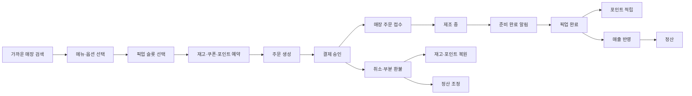
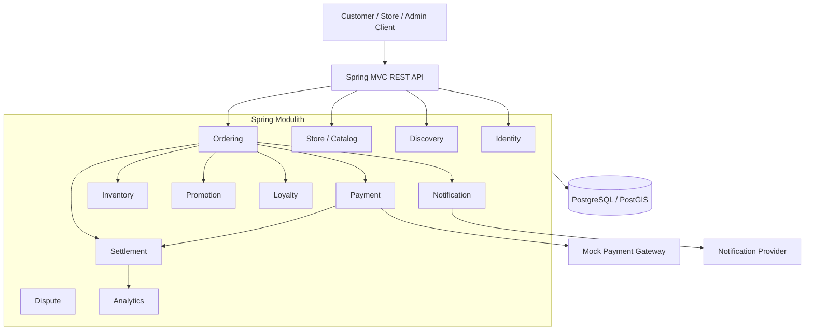

# BeanFlow

> 카페 선주문부터 결제, 포인트, 픽업, 정산까지 이어지는 거래 생명주기를
> DDD와 Modular Monolith로 설계하고 정합성·동시성·성능을 검증하는 백엔드 프로젝트

**현재 상태: M0 Walking Skeleton 설계 및 개발 중**

---

## 1. 프로젝트 소개

BeanFlow는 고객이 가까운 카페를 찾고 원하는 시간에 미리 주문한 뒤, 매장에서 준비 완료 알림을 받고 픽업할 수 있는 카페 주문 플랫폼입니다.

단순한 주문 CRUD 구현이 아니라 다음과 같은 실제 거래 시스템의 문제를 다룹니다.

* 동일 주문과 결제 요청이 여러 번 전달되는 문제
* 결제 승인 후 서버 장애로 결과가 저장되지 않는 문제
* 마지막 재고와 픽업 슬롯을 여러 사용자가 동시에 확보하는 문제
* 쿠폰과 포인트가 중복 사용되는 문제
* 포인트 유효기간과 환불 후 복원 문제
* 정산 확정 이후 부분 환불이 발생하는 문제
* 이벤트와 알림이 중복 전달되거나 처리 도중 실패하는 문제
* 주문량 증가에 따라 조회 쿼리와 응답시간이 악화되는 문제

이 프로젝트의 목표는 많은 기술을 나열하는 것이 아니라, 복잡한 비즈니스 규칙을 명확한 도메인 모델로 표현하고 선택의 결과를 테스트와 측정값으로 증명하는 것입니다.

---

## 2. 핵심 사용자

| 사용자    | 주요 목적                         |
| ------ | ----------------------------- |
| 고객     | 가까운 매장을 찾고 원하는 시간에 주문·결제·픽업   |
| 점주     | 메뉴, 가격, 영업시간, 재고, 프로모션과 매출 관리 |
| 매장 직원  | 주문 접수, 제조 상태 변경, 준비 완료 처리     |
| 운영자    | 실패 작업 확인, 재처리, 정책 및 감사 이력 관리  |
| 정산 담당자 | 주문·결제·환불을 기준으로 정산 결과 확인 및 조정  |
| CS 담당자 | 취소·환불·정산 이의제기 처리              |

---

## 3. 핵심 거래 흐름



---

## 4. 주요 기능과 범위

### M0 — 4주 Walking Skeleton

* 고객·점주·직원·운영자 인증과 권한
* 매장·메뉴·옵션·영업시간 관리
* 현재 위치 기반 가까운 매장 검색
* 픽업 시간과 PickupSlot 수용량 관리
* 메뉴·옵션 재고 예약과 해제
* 주문 시점의 이름·가격·옵션 스냅샷
* 모의 PG 기반 결제 승인과 멱등성
* 주문 접수·제조·준비 완료·픽업 완료 상태 전환
* 준비 완료 앱 내 알림
* 주문·결제 기반 기초 정산
* 감사 로그와 실패 작업 조회

### M1 — 8주 MVP

* 포인트 적립·사용·유효기간·소멸 예정 조회
* 주문 취소 시 사용 포인트 복원
* 쿠폰·기간 할인·프로모션
* 결제 부분 환불
* 확정 정산 이후 Adjustment Ledger
* 정산 이의제기
* 매출·순매출·주문수·객단가·환불률 분석
* k6 부하 테스트와 PostgreSQL 실행계획 분석
* OpenAPI와 Spring REST Docs
* 메트릭·로그·장애 재처리 체계

### 이후 확장

* 충전식 선불 카드와 거래 원장
* POS·물리 프린터 연동
* 딜리버리
* 점주 AI 매출 인사이트
* 운영 자동화 AI
* 고객 자연어 메뉴 검색
* 맞춤형 프로모션과 광고
* Kafka 기반 일부 모듈 분리

---

## 5. 기술 구성

| 영역             | 기술                                        |
| -------------- | ----------------------------------------- |
| Language       | Kotlin                                    |
| Framework      | Spring Boot, Spring MVC                   |
| Architecture   | DDD, Modular Monolith, Spring Modulith    |
| Persistence    | Spring Data JPA, Hibernate                |
| Database       | PostgreSQL, PostGIS                       |
| Schema         | Flyway                                    |
| Security       | Spring Security, OAuth2 Resource Server   |
| API            | REST, OpenAPI, Spring REST Docs           |
| Testing        | JUnit 5, Kotest, Testcontainers, ArchUnit |
| Load Test      | k6                                        |
| Observability  | Spring Boot Actuator, Micrometer          |
| Build          | Gradle Kotlin DSL                         |
| Infrastructure | Docker Compose                            |

Redis, Kafka, Spring AI는 프로젝트 시작 시 기본 의존성으로 추가하지 않습니다. PostgreSQL과 모듈 내부 이벤트로 먼저 구현하고, 병목과 분리 필요성을 측정한 뒤 도입합니다.

---

## 개발 워크플로

BeanFlow는 `main`을 항상 배포 가능한 상태로 유지하는 GitHub Flow를 사용합니다. 최신 `main`에서 짧은 작업 브랜치를 만들고, Pull Request의 승인과 필수 CI 통과 후 squash merge합니다.

브랜치 이름, 커밋 규칙, 리뷰 및 병합 기준은 [`CONTRIBUTING.md`](CONTRIBUTING.md)를 따릅니다.

---

## 6. 아키텍처

BeanFlow는 처음부터 마이크로서비스로 나누지 않고 Spring Modulith 기반의 Modular Monolith로 시작합니다.



모듈 간에는 다른 모듈의 JPA Entity를 직접 참조하지 않습니다. 필요한 경우 식별자, 공개 API 또는 도메인 이벤트를 사용합니다.

각 모듈의 상세 책임은 [`docs/domain/context-map.md`](docs/domain/context-map.md)에서 확인할 수 있습니다.

---

## 7. 핵심 설계 원칙

### Aggregate별 트랜잭션 경계

Repository는 엔티티마다 만들지 않고 Aggregate Root를 기준으로 정의합니다.

예를 들어 `OrderLine`은 독립 Repository를 갖지 않으며 `Order`를 통해서만 변경합니다.

### Aggregate 간 식별자 참조

`Payment`가 JPA 연관관계로 `Order` Entity를 직접 참조하지 않고 `orderId`를 저장합니다.

이를 통해 다음을 기대합니다.

* Aggregate 경계 유지
* 불필요한 연쇄 로딩 방지
* 양방향 연관관계 제거
* 독립적인 트랜잭션 경계
* 향후 서비스 분리 가능성 확보

### 주문 가격 스냅샷

주문 항목은 현재 메뉴 Entity를 조회해 금액을 계산하지 않습니다.

주문 생성 당시 다음 값을 스냅샷으로 보존합니다.

* 메뉴 식별자
* 메뉴명
* 옵션
* 단가
* 수량

이후 메뉴 가격이 변경되어도 과거 주문·환불·정산 결과가 달라지지 않습니다.

### 확정 정산 불변

정산 확정 후 환불이 발생해도 과거 정산 결과를 덮어쓰지 않습니다.

기존 정산은 유지하고 다음 정산 주기에 조정 항목을 추가하는 Adjustment Ledger 방식을 사용합니다.

### 외부 시스템 호출과 DB 트랜잭션 분리

결제 Gateway와 알림 Provider 호출은 장시간 데이터베이스 트랜잭션 내부에서 수행하지 않습니다.

외부 응답이 성공했지만 내부 저장이 실패할 수 있으므로 멱등성, 재조회, reconciliation을 별도로 설계합니다.

---

## 8. 주요 기술적 챌린지

| 문제               | 검토 대안                                      | 결정                                 | 검증                    |
| ---------------- | ------------------------------------------ | ---------------------------------- | --------------------- |
| 중복 주문 생성         | 클라이언트 방지, Redis Lock, DB 멱등성               | Idempotency-Key와 Unique Constraint | 동시 요청 통합 테스트          |
| PG 성공 후 DB 장애    | 긴 트랜잭션, 상태 조회, 보상 처리                       | 외부 호출 분리와 reconciliation           | 장애 주입 테스트             |
| 마지막 재고 동시 주문     | 낙관적 Lock, 비관적 Lock, 원자적 UPDATE             | 실험 후 결정                            | k6, Lock Wait, p95 비교 |
| PickupSlot 초과 예약 | Entity Lock, 조건부 UPDATE                    | 실험 후 결정                            | 동시 예약 테스트             |
| 포인트 중복 적립        | 이벤트 exactly-once 주장, 소비자 멱등성               | 주문·이벤트 기준 Unique Constraint        | 중복 이벤트 테스트            |
| 정산 후 부분 환불       | 과거 정산 수정, 전체 재계산, 조정 원장                    | Adjustment Ledger                  | 금액 tie-out 테스트        |
| 주문 목록 N+1        | EAGER, Fetch Join, EntityGraph, Projection | API별 조회 전략 분리                      | SQL 수와 실행계획 비교        |

실험 전에는 특정 방식이 더 빠르다고 단정하지 않습니다. 모든 결정은 동일한 조건에서 측정한 결과와 함께 ADR로 기록합니다.

---

## 9. API 예시

```http
GET  /api/v1/stores/nearby
GET  /api/v1/stores/{storeId}/menus

POST /api/v1/orders
GET  /api/v1/orders/{orderId}
POST /api/v1/orders/{orderId}/acceptances
POST /api/v1/orders/{orderId}/preparation-completions
POST /api/v1/orders/{orderId}/pickup-completions
POST /api/v1/orders/{orderId}/cancellations

POST /api/v1/orders/{orderId}/payment-confirmations
POST /api/v1/payments/{paymentId}/refunds

POST /api/v1/campaigns/{campaignId}/coupon-issuances

GET  /api/v1/stores/{storeId}/settlements
POST /api/v1/settlement-items/{settlementItemId}/disputes
```

상세 계약은 다음 문서에서 관리합니다.

* [`openapi/beanflow-openapi.yaml`](openapi/beanflow-openapi.yaml)
* [`docs/api/api-guidelines.md`](docs/api/api-guidelines.md)
* [`docs/api/error-response.md`](docs/api/error-response.md)

---

## 10. 테스트 전략

| 테스트 계층            | 검증 대상                           |
| ----------------- | ------------------------------- |
| Domain Unit Test  | 상태 전이, 금액 계산, 불변식               |
| Application Test  | 유스케이스와 트랜잭션 조정                  |
| Repository Test   | JPA 매핑, Query, Lock, Constraint |
| API Test          | HTTP 계약, 인증·인가, 오류 응답           |
| Module Test       | Spring Modulith 모듈 경계와 이벤트      |
| Architecture Test | 순환 의존과 계층 위반                    |
| Concurrency Test  | 재고·슬롯·쿠폰·결제 경쟁 조건               |
| Failure Test      | 외부 시스템 장애, 재시도, 중복 이벤트          |
| Load Test         | 처리량, p95·p99, 오류율, Lock Wait    |

H2를 PostgreSQL의 대체 데이터베이스로 사용하지 않습니다. Repository와 통합 테스트는 Testcontainers PostgreSQL 환경에서 실행합니다.

```bash
./gradlew test
```

---

## 11. 성능 검증

성능 개선은 다음 절차로 수행합니다.

```text
증상 관찰
→ 재현 조건 고정
→ 기준선 측정
→ 실행계획·로그·메트릭 분석
→ 병목 가설 수립
→ 최소 변경
→ 재측정
→ 회귀 테스트
→ 결과 문서화
```

측정할 주요 항목:

* RPS
* p50, p95, p99
* 오류율
* SQL 실행 횟수
* PostgreSQL 실행계획
* Index Scan 및 Sequential Scan
* Lock Wait
* Connection Pool active·pending
* JVM Heap과 GC
* CPU와 메모리

현재 결과:

| 실험            |  변경 전 |  변경 후 | 문서                                           |
| ------------- | ----: | ----: | -------------------------------------------- |
| 주문 목록 조회      | 측정 예정 | 측정 예정 | `docs/benchmarks/query-optimization.md`      |
| 재고 동시성        | 측정 예정 | 측정 예정 | `docs/benchmarks/inventory-concurrency.md`   |
| PickupSlot 예약 | 측정 예정 | 측정 예정 | `docs/benchmarks/pickup-slot-concurrency.md` |

실제로 측정하기 전에는 임의의 개선 수치를 작성하지 않습니다.

---

## 12. AI-Driven Development

BeanFlow에서는 Codex와 ChatGPT를 단순 코드 생성 도구가 아니라 요구사항 분석과 검증을 돕는 개발 도구로 사용합니다.

작업은 다음 순서로 진행합니다.

```text
PRD 분석
→ 불명확한 정책 질문
→ 도메인 모델과 대안 비교
→ ADR
→ 실패 테스트
→ 최소 구현
→ 통합 테스트
→ SQL·성능 분석
→ 문서 갱신
```

AI 작업 지시서에는 다음 내용을 포함합니다.

* Goal
* Business Context
* Domain Invariants
* Architecture Constraints
* Scope
* Non-goals
* Acceptance Criteria
* Required Tests
* Validation Commands
* Documentation Updates

AI가 생성한 결과는 테스트, 정적 분석, diff review를 통과한 경우에만 반영합니다.

저장소 탐색과 변경 규칙은 [`AGENTS.md`](AGENTS.md)에 기록합니다.

---

## 13. 실행 방법

### 요구 환경

* JDK 21
* Docker
* Docker Compose

### 로컬 인프라 실행

```bash
docker compose up -d
```

### 애플리케이션 실행

```bash
./gradlew bootRun --args='--spring.profiles.active=local'
```

### 테스트

```bash
./gradlew test
```

### 종료

```bash
docker compose down
```

환경 변수와 로컬 설정은 `.env.example`을 참고합니다.

실제 비밀번호와 토큰은 저장소에 커밋하지 않습니다.

---

## 14. 문서

| 문서                                     | 설명                               |
| -------------------------------------- | -------------------------------- |
| [`ARCHITECTURE.md`](ARCHITECTURE.md)   | 전체 시스템 구조와 설계 원칙                 |
| [`docs/prd/`](docs/prd/)               | 제품 요구사항과 사용자 시나리오                |
| [`docs/domain/`](docs/domain/)         | 용어집, Context Map, Aggregate, 이벤트 |
| [`docs/adr/`](docs/adr/)               | 주요 기술적 의사결정                      |
| [`docs/api/`](docs/api/)               | API 규칙과 오류 계약                    |
| [`docs/benchmarks/`](docs/benchmarks/) | 부하 테스트와 성능 개선 결과                 |
| [`docs/incidents/`](docs/incidents/)   | 장애 재현과 해결 과정                     |
| [`docs/exec-plans/`](docs/exec-plans/) | Codex 실행 계획과 완료 기록               |
| [`openapi/`](openapi/)                 | OpenAPI 명세                       |

---

## 15. 로드맵

* [ ] M0 PRD와 Ubiquitous Language
* [ ] Spring Modulith 모듈 경계
* [ ] PostgreSQL·Flyway·Testcontainers
* [ ] 매장·메뉴·가까운 매장 검색
* [ ] PickupSlot과 기초 재고
* [ ] 주문 가격 스냅샷
* [ ] 모의 결제와 멱등성
* [ ] 주문 상태와 준비 완료 알림
* [ ] 기초 정산
* [ ] 포인트 Lot과 유효기간
* [ ] 쿠폰·프로모션
* [ ] 부분 환불과 정산 조정
* [ ] 매출 분석
* [ ] k6 부하 테스트
* [ ] 실행계획 기반 쿼리 최적화
* [ ] 장애 주입과 복구 테스트
* [ ] 데모 배포

상세 범위와 우선순위는 [`docs/prd/m0-walking-skeleton.md`](docs/prd/m0-walking-skeleton.md)에서 관리합니다.

---

## 16. 프로젝트에서 다루지 않는 것

M0에서는 다음 기능을 의도적으로 제외합니다.

* 실제 PG사 연동
* 실제 SMS·Push 전송
* 충전식 선불 카드
* 실물 POS·프린터
* 딜리버리
* 원재료·발주 중심 고급 재고
* 제품 내 AI
* 맞춤형 광고
* Kafka 기반 서비스 분리
* Kubernetes 배포

핵심 거래 흐름과 정합성을 먼저 검증한 뒤, 명확한 요구와 분리 근거가 생겼을 때 확장합니다.

---

## 17. 라이선스

이 프로젝트는 학습 및 포트폴리오 목적으로 개발되고 있습니다.

라이선스 정책은 공개 범위 확정 후 추가할 예정입니다.
