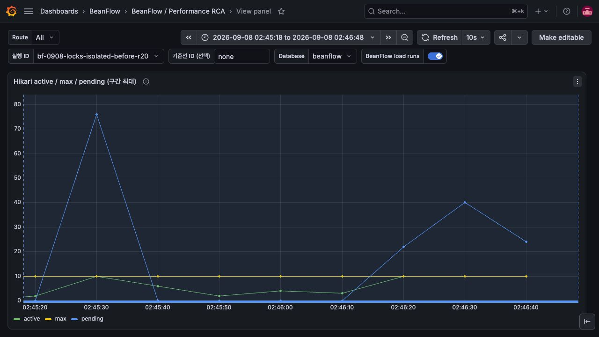
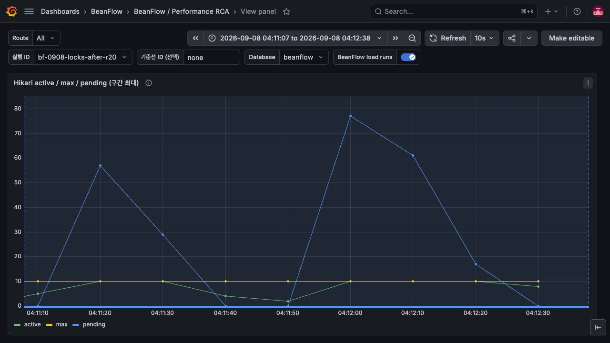

# 감사 기록 append 전용 persist 경로 검증

## 변경 근거와 동작

새 UUID 감사 기록에 merge가 수행하던 불필요한 존재 확인 SELECT를 제거한다.

AuditRecordService가 생성한 새 entity만 `AuditRecordAppendRepository`의 persist/flush로 저장한다.
새 repository는 `@Repository`, `@Transactional(MANDATORY)`로 호출자의 transaction과 예외 변환을
유지한다. 조회 repository는 유지한다. 독립 operator/ordinary-policy bootstrap의 좁은 Spring
configuration에도 writer를 명시적으로 import한다. import 누락 회귀를 같은 PR에서 원자적으로 해결한다.

## 개별 수정의 검증

추가 audit 3건의 statement 증가량은 기존 **6개 → 3개**다. 단순 INSERT 추가뿐 아니라 UUID existence
SELECT 제거를 Hibernate statistics로 검증했다. 기존 구현에서 이 회귀 assertion이 실패한 것을 확인했다.
새 감사 저장 경로, 중복 batch 전체 rollback, 원문 PII 거절, retention, 두 독립 bootstrap의 실제 append를 검증했다.
main 기반 분리 worktree에서 **30개 테스트 및 bootJar 통과**, failure/error/skipped 0.
통합 regression 110개와 추가 bootstrap/audit 23개에는 겹치는 테스트가 있으므로 합산하지 않는다.

[Spring Data JPA의 entity 상태 판별 계약](https://docs.spring.io/spring-data/jpa/reference/jpa/entity-persistence.html)에
따라 수동 UUID가 있는 새 append를 일반 save/merge 경로로 보내지 않도록 했다.

```bash
./gradlew --no-daemon -Pkotlin.incremental=false test --tests '*AuditRecordTest' --tests '*AuditRetentionPolicyIntegrationTest' --tests '*OperatorPermissionBootstrapApplicationTest' --tests '*OrdinaryPointAccrualPolicyBootstrapApplicationTest' --tests '*OperatorPermissionIntegrationTest' --tests '*OrdinaryPointAccrualPolicyBootstrapTest' bootJar
```

## 실제 배포와 통합 부하 결과

통합 revision `686ba07885ac0f7fece39da6a3569208c6bf1094`를 배포했다. 이미지 digest는
`sha256:46f2167d5885596cf358bd1e962e6d22edc13660415ffedd5e1f8d7cffb2f576`이다.
[전체 CI](https://github.com/kdh949/BeanFlow/actions/runs/34151795027)와
[이미지 workflow](https://github.com/kdh949/BeanFlow/actions/runs/34151796891)가 통과했다.
분리 PR의 head CI와 통합 이미지 검증은 서로 다른 증거다.

같은 합성 고객 20명·매장/메뉴/공유 재고 각 1개·미래 픽업 슬롯 4개에서 수량 1,
쿠폰/포인트 없는 `toss-success`를 사용했다. HTTPS WAF를 통해 견적→주문→결제 시도→승인
4 HTTP 요청을 실행했다. API 2GiB, PostgreSQL 1.5GiB, Hikari 10, trace sampling 1.0,
wall profile 10ms와 load script를 고정했다. 로컬 Gradle 실행과 아래 부하는 겹치지 않았다.

| 실행 ID | 부하 | pre/max VU | 승인 | 미시작(dropped) | HTTP p95/p99(ms) | workflow p95(ms) |
|---|---|---|---:|---:|---:|---:|
| bf-0908-locks-before-r20 | 20/s,90s | 80/80 | 1659 | 142 | 1744.4 / 2575.5 | 6362.9 |
| bf-0908-locks-isolated-before-r20 | 20/s,90s | 80/80 | 1718 | 83 | 1338.6 / 2418.1 | 5625.8 |
| bf-0908-locks-after-r20 | 20/s,90s | 80/80 | 1698 | 102 | 1482.0 / 2424.1 | 5366.8 |
| bf-0908-locks-after-r20-repeat | 20/s,90s | 80/80 | 1648 | 152 | 1772.4 / 2812.5 | 6856.4 |

위 실행 모두 시작한 workflow의 실패율은 0이지만 목표 부하의 일부를 시작하지 못했고
threshold는 FAILED다. 수정 후 HTTP p95와 dropped가 기존 두 측정 사이에 있다.
반복 실행은 직전 20/s 코호트의 환불 처리가 겹쳤고 결과도 나빠졌다.
**전체 처리량·HTTP 지연 개선은 입증되지 않았다.** 이 부하는 각 SQL 수정 하나만 교체한 A/B가 아니다.
기존 UNKNOWN 환불 재시도 8270건은 현재 MANUAL_REVIEW로 이행해 background가 달라졌고,
수정 후에는 환불 성공에 따라 새 금융 event publication이 발생했다. 누적 DB 크기도 증가했다.
`isolated`는 실행 이름이며 격리가 입증됐다는 의미가 아니다.

수정 후 본 실행의 Prometheus 표본 최대는 Hikari active 10/pending 77, DB ungranted lock 5,
호스트 CPU 85.8%, iowait 14.9%, API CPU 2.44 cores였다. Grafana를 브라우저로 확인했다.
대표 trace `ed587e1bae7562e6a80a1218b2db45e`에서 승인 요청 1582ms 중 pickup SELECT가 341ms였다.
repository span 전체를 lock 또는 connection pool 대기로 환산하지 않는다.

2026-09-07 19:16:46 UTC read-only repeatable-read 확인에서 예열141·5/s301·20/s1698건의
native 생성/승인 수와 DB가 일치했다. stock/slot counter 불일치, 정원 초과, 중복 픽업번호는 0이었다.
예열+5/s 442건은 환불/보상/재고/정원 복구 SUCCEEDED였다. 본 실행의 비동기 환불은 당시 진행 중이었다.
환불 이후 정산·분석 금융 이벤트의 미완료 기록은 별도 잔여 문제이며 거래 전체 완료로 표시하지 않는다.

부하 fixture SHA256: `e08f3fa7e965527e527b47326e82981b7c05b10d1a1d9c5d365a7611bf5daca9`.
script SHA256: `3f91175346682f67d0f2e2dfb73611b5550b5894665097a6bbf153692aa48301`.
raw fixture/토큰/개별 결제 내역은 공개하지 않는다. Grafana 캡처는 실제 저장된 해당 시각의 지표를
현재 패널로 조회한 것이다. 그림의 rolling percentile과 표의 native 최종 percentile을 혼동하지 않는다.

## 실패·한계와 롤백

append repository에 이미 존재하는 entity를 넘기면 실패해야 한다. 실패를 무시하거나 감사 저장을 비동기 성공으로 처리하지 않는다.

DB migration이나 공개 API 형태 변경은 없다. 이전 immutable 이미지와 설정 백업으로 되돌릴 수 있으나
perf driver 재시작 시 기존 결제 이력의 명시적 snapshot/restore 검증이 필요하다.

## Grafana 캡처

수정 전 (실제 패널의 시각과 축을 함께 확인):



수정 후 (실제 패널의 시각과 축을 함께 확인):



감사 SELECT 개수는 Grafana에 전용 지표가 없어 위 Hikari 패널은 전체 부하 문맥만 보여준다. 감사 수정 단독 효과는 SQL 회귀 테스트로 판단한다.

## 캡처 파일의 CI 등록

PR에 추가한 PNG가 기존 저장소 안전성 테스트의 명시적 바이너리 목록에 없어 CI가 실패했다.
검토한 이 PR 시리즈의 Grafana PNG 14개 경로만 공통 목록에 등록했다. 새 확장자 전체를 제외하거나
비밀 패턴 검사를 비활성화하지 않는다. `LocalDemoRepositorySafetyTest` 5개 테스트를 로컬에서
통과시켰으며, 변경된 각 PR head의 전체 CI를 다시 실행한다.
