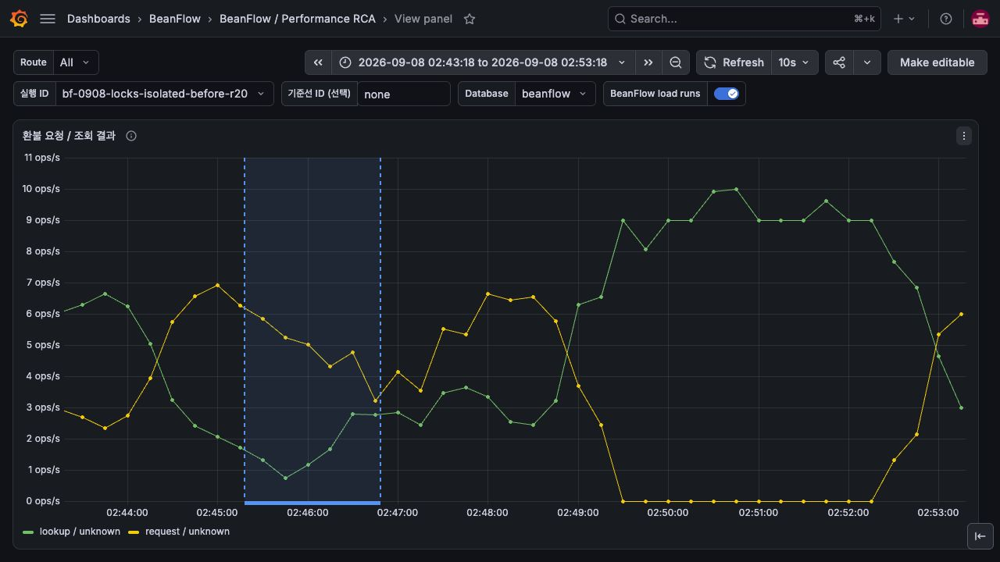
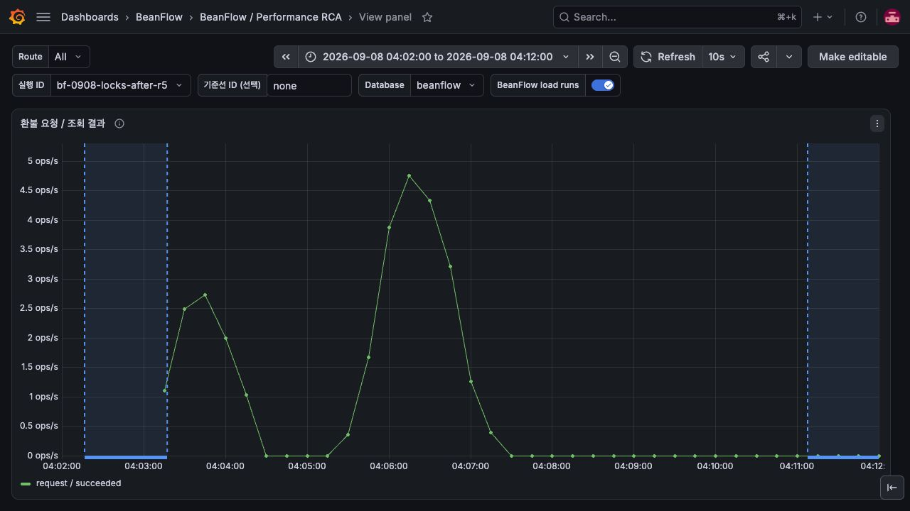

# 성능 드라이버 결제 이력 보존 검증

## 문제와 변경

기존 드라이버는 결제 10,000건을 넘으면 가장 오래된 결제·주문 인덱스·재생 응답·취소 이력을 지웠다.
승인 성공 이후 lookup이 404가 되면 부하 실험의 복구 의미가 깨지고 실제 애플리케이션 오류와
드라이버 데이터 손실을 구분하기 어렵다. 보관 한도를 50,000건으로 늘리고 자동 삭제를 제거했다.
가득 차면 **새 결제만 503 DRIVER_CAPACITY_EXCEEDED**로 거절한다. 기존 결제의 confirmation
replay, 조회 및 환불은 유지한다. 기존 결제를 먼저 찾은 뒤 신규 용량을 검사한다.

## 근거와 검증

- 코드를 통해 10,000건 자동 eviction 경계를 확인했다. 과거 결제 유실이 실제 발생했다고 주장하지 않는다.
- 분리 브랜치에서 `node --test infra/perf/toss-driver.test.mjs`: **10/10 Passed**, skipped 0.
- 작은 주입 용량으로 포화 상태를 만들고 신규 승인 503, 기존 GET/confirmation replay/refund 보존을
  검증했다. 잘못된 설정(0, 음수, 비정수, 상한 초과)은 시작 단계에서 거절한다.
- 실제 배포 전 8,270건을 snapshot/restore 후 전부 검증했다. 이후 합성 부하 3,788건을 더 생성했다.
- 2026-09-08 KST 배포 후 읽기 전용 GET 검사: **12,058건 조회 / 12,058건 존재 / 누락 0건**.
  상태는 이전 DONE 8,270건, 신규 CANCELED 3,788건, 취소 이력 3,788개다.
  이는 예전 10,000건 경계를 넘긴 상태에서 과거 이력과 신규 환불이 함께 유지된 실제 증거다.
- **50,000건 실제 생성 시험은 Not run**이다. 현재 결과를 최대 용량·장시간 메모리 안정성 증거로 확대하지 않는다.

검증한 통합 코드 `686ba07885ac0f7fece39da6a3569208c6bf1094`, 이미지
`sha256:46f2167d5885596cf358bd1e962e6d22edc13660415ffedd5e1f8d7cffb2f576`.
[전체 CI](https://github.com/kdh949/BeanFlow/actions/runs/34151795027) 및
[이미지 workflow](https://github.com/kdh949/BeanFlow/actions/runs/34151796891)는 통과했다.
분리 head 검증은 PR checks를 별도로 확인한다.

## Grafana의 전후 문맥

현재 Grafana에는 driver retained-payment count 전용 metric이 없다. 다음 캡처는 환불 계약 PR의
수정 전 UNKNOWN/lookup과 통합 배포 후 SUCCEEDED를 보여주는 **환불 문맥**이며 보관 개수의 그래프가 아니다.
전후 시도율 높낮이는 비교하지 않는다. 이 PR 단독의 보관 보장은 위 HTTP 조회와 경계 테스트로 증명한다.

## 실패 경계와 운영

- in-memory 저장은 여전히 process 재시작에 영속적이지 않다. 재배포 전에 API를 멈추고 driver 사실을
  snapshot한 뒤 복원/검증하는 명시적 절차가 필요하다. 이전 이미지로 되돌릴 때 10,000건 한도를 주의한다.
- 503은 새 사실을 저장하지 않은 명시적 포화다. 기존 결제 사실을 지워 빈 용량을 만들지 않는다.
- 조회 검사는 앱 DB의 합성 perf 결제만 대상으로 수행했고 raw key/응답/자격증명은 공개하지 않았다.
- 앱 DB에서 신규 3,788건의 환불·보상·정원 복구는 SUCCEEDED다. 별도 금융 이벤트
  7,576건은 미완료여서 정산/분석 소비까지 완료된 것으로 표현하지 않는다.
- 20/s,90s,80VU의 수정 후 두 실행은 각각 승인1,698/1,648, dropped102/152,
  HTTP p95 1,482.0/1,772.4ms로 threshold FAILED다. 처리량 향상은 입증되지 않았다.

## 대안과 결정

가득 찰 때 오래된 사실을 삭제하는 정책 대신 새 요청을 명시적으로 거절한다. 영속 저장소나 TTL
정책 도입은 별도 실패 모델이 필요하므로 이 PR에 추가하지 않는다. 설정 주입은 테스트를 위한
함수 인자이며 외부 환경변수 또는 임의 무제한 보관을 허용하지 않는다. 업무 DB migration 및
공개 BeanFlow API 형태 변경은 없다.

## 캡처 파일의 CI 등록

PR에 추가한 PNG가 기존 저장소 안전성 테스트의 명시적 바이너리 목록에 없어 CI가 실패했다.
검토한 이 PR 시리즈의 Grafana PNG 14개 경로만 공통 목록에 등록했다. 새 확장자 전체를 제외하거나
비밀 패턴 검사를 비활성화하지 않는다. `LocalDemoRepositorySafetyTest` 5개 테스트를 로컬에서
통과시켰으며, 변경된 각 PR head의 전체 CI를 다시 실행한다.
