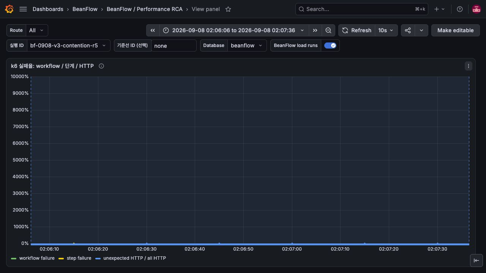
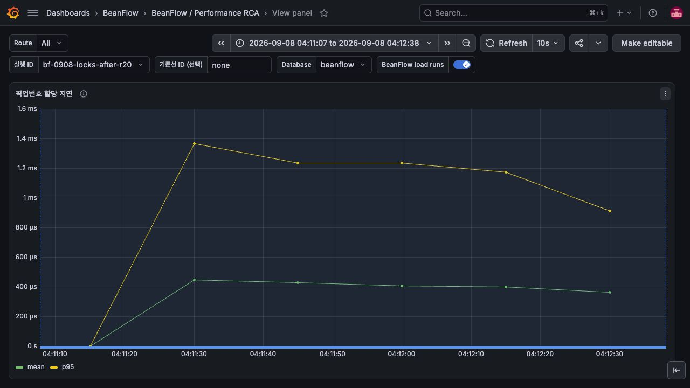

# 환불과 픽업번호 진단 패널 및 실패율 축 검증

## 변경 근거와 동작

기존 대시보드에 없던 환불 시도 결과와 픽업번호 SQL 주변 지연을 실제 부하 구간과 연결한다.

151은 `beanflow_payment_refund_attempts_total`의 mode/outcome별 rate, 152는 pickup sequence
allocation timer의 평균과 p95다. 기존 63개 패널을 보존하고 2개를 추가했다. panel 112의 percentunit
최대값을 1로 고정해 실패율 0인 실행에서 자동 축이 10,000%까지 늘어나는 표시 문제를 수정했다.

## 개별 수정의 검증

모니터링 서버의 durable provisioning JSON을 백업하고 reload했다. Grafana API readback과
브라우저의 실제 과거/현재 실행 구간에서 151/152 데이터를 확인했다. 실패율 패널의 전후 캡처는
같은 0% 데이터에서 10,000% 자동 축 → 100% 고정 축으로 바뀐 결과다. 지표 자체를 수정하지 않았다.
패널 JSON 및 기존 query contract 검증은 통과했다. 추가 패널은 제품 latency 개선을 주장하지 않는다.

```bash
python3 scripts/perf/test-dashboard-queries.py
```

### 평균 지연의 무관측 구간 검증 (2026-09-08)

픽업번호 평균의 분모를 `clamp_min`으로 보정하면 호출이 없는 구간도 0초로 표시된다.
분모에 `rate(count) > 0` 필터를 적용하여 호출이 관측된 인스턴스만 평균을 반환한다.
`bool`을 사용하지 않아 양수인 count rate의 원래 값을 나눗셈에 유지한다.
이는 [Prometheus 비교 연산자의 필터 동작](https://prometheus.io/docs/prometheus/latest/querying/operators/#comparison-binary-operators)을 따른다.

Prometheus v3.14.0의 promtool로 dashboard JSON의 실제 쿼리를 평가했다. 새 6개 사례는
최초 무호출, 이전 호출 후 유휴, 지표 누락, 정상 평균, 관측된 실제 0초, 유휴/활성 인스턴스 혼합이다.
수정 전 쿼리에서 무호출 2개와 혼합 1개가 잘못된 0 샘플을 반환해 실패했고,
수정 후 새 6개와 기존 DB wait 7개가 모두 통과했다. 정상 평균 0.5초와 관측된 0초는 유지된다.
전체 관측성 계약(`test-observability-contract.sh`)과 문서/OpenAPI 검증도 통과했다.

이 보강의 모니터링 서버 재배포와 부하 재측정은 **Not run**이다. 아래 Grafana 캡처는
보강 전 쿼리로 확인한 과거 측정 증거이며, 새 무관측 처리의 검증은 위 promtool 회귀 테스트다.

## 실제 배포와 통합 부하 결과

통합 revision `686ba07885ac0f7fece39da6a3569208c6bf1094`를 배포했다. 이미지 digest는
`sha256:46f2167d5885596cf358bd1e962e6d22edc13660415ffedd5e1f8d7cffb2f576`이다.
[전체 CI](https://github.com/kdh949/BeanFlow/actions/runs/34151795027)와
[이미지 workflow](https://github.com/kdh949/BeanFlow/actions/runs/34151796891)가 통과했다.
분리 PR의 head CI와 통합 이미지 검증은 서로 다른 증거다.

같은 합성 고객 20명·매장/메뉴 각 1개·미래 픽업 슬롯 4개에서 수량 1,
쿠폰/포인트 없는 `toss-success`를 사용했다. HTTPS WAF를 통해 견적→주문→결제 시도→승인
4 HTTP 요청을 실행했다. API 2GiB, PostgreSQL 1.5GiB, Hikari 10, trace sampling 1.0,
wall profile 10ms와 load script를 고정했다. 로컬 Gradle 실행과 아래 부하는 겹치지 않았다.

| 실행 ID | 부하 | pre/max VU | 승인 | 미시작(dropped) | HTTP p95/p99(ms) | workflow p95(ms) |
|---|---|---|---:|---:|---:|---:|
| bf-0908-locks-before-r20 | 20/s,90s | 80/80 | 1659 | 142 | 1744.4 / 2575.5 | 6362.9 |
| bf-0908-locks-isolated-before-r20 | 20/s,90s | 80/80 | 1718 | 83 | 1338.6 / 2418.1 | 5625.8 |
| bf-0908-locks-after-r20 | 20/s,90s | 80/80 | 1698 | 102 | 1482.0 / 2424.1 | 5366.8 |
| bf-0908-locks-after-r20-repeat | 20/s,90s | 80/80 | 1648 | 152 | 1772.4 / 2812.5 | 6856.4 |

위 실행 모두 시작한 workflow의 실패율은 0이지만 목표 부하의 일부를 시작하지 못했고
threshold는 FAILED다. 수정 후 HTTP p95와 dropped가 기존 두 측정 사이에 있다.
반복 실행은 직전 20/s 코호트의 환불 처리가 겹쳤고 결과도 나빠졌다.
**전체 처리량·HTTP 지연 개선은 입증되지 않았다.** 이 부하는 각 SQL 수정 하나만 교체한 A/B가 아니다.
기존 UNKNOWN 환불 재시도 8270건은 현재 MANUAL_REVIEW로 이행해 background가 달라졌고,
수정 후에는 환불 성공에 따라 새 금융 event publication이 발생했다. 누적 DB 크기도 증가했다.
`isolated`는 실행 이름이며 격리가 입증됐다는 의미가 아니다.

수정 후 본 실행의 Prometheus 표본 최대는 Hikari active 10/pending 77, DB ungranted lock 5,
호스트 CPU 85.8%, iowait 14.9%, API CPU 2.44 cores였다. Grafana를 브라우저로 확인했다.
대표 trace `ed587e1bae7562e6a80a1218b2db45e`에서 승인 요청 1582ms 중 pickup SELECT가 341ms였다.
repository span 전체를 lock 또는 connection pool 대기로 환산하지 않는다.

2026-09-07 19:16:46 UTC read-only repeatable-read 확인에서 예열141·5/s301·20/s1698건의
native 생성/승인 수와 DB가 일치했다. stock/slot counter 불일치, 정원 초과, 중복 픽업번호는 0이었다.
예열+5/s 442건은 환불/보상/정원 복구 SUCCEEDED였다. 본 실행의 비동기 환불은 당시 진행 중이었다.
환불 이후 정산·분석 금융 이벤트의 미완료 기록은 별도 잔여 문제이며 거래 전체 완료로 표시하지 않는다.

부하 fixture SHA256: `e08f3fa7e965527e527b47326e82981b7c05b10d1a1d9c5d365a7611bf5daca9`.
script SHA256: `3f91175346682f67d0f2e2dfb73611b5550b5894665097a6bbf153692aa48301`.
raw fixture/토큰/개별 결제 내역은 공개하지 않는다. Grafana 캡처는 실제 저장된 해당 시각의 지표를
현재 패널로 조회한 것이다. 그림의 rolling percentile과 표의 native 최종 percentile을 혼동하지 않는다.

## 실패·한계와 롤백

환불 시도율은 환불 미완료 잔액/건수가 아니다. timer p95는 전체 transaction 잠금 보유 시간이 아니며, No data를 0으로 대체하지 않는다.

DB migration이나 공개 API 형태 변경은 없다. 이전 immutable 이미지와 설정 백업으로 되돌릴 수 있으나
perf driver 재시작 시 기존 결제 이력의 명시적 snapshot/restore 검증이 필요하다.

## Grafana 캡처

수정 전 (실제 패널의 시각과 축을 함께 확인):



수정 후 (실제 패널의 시각과 축을 함께 확인):


추가 패널의 실제 데이터:




## 캡처 파일의 CI 등록

PR에 추가한 PNG가 기존 저장소 안전성 테스트의 명시적 바이너리 목록에 없어 CI가 실패했다.
검토한 이 PR 시리즈의 Grafana PNG 14개 경로만 공통 목록에 등록했다. 새 확장자 전체를 제외하거나
비밀 패턴 검사를 비활성화하지 않는다. `LocalDemoRepositorySafetyTest` 5개 테스트를 로컬에서
통과시켰으며, 변경된 각 PR head의 전체 CI를 다시 실행한다.
