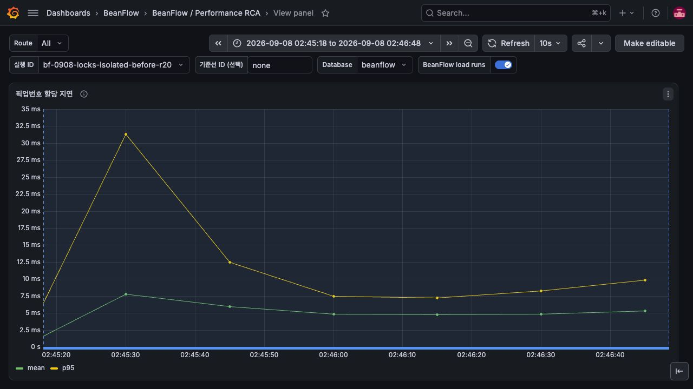

# 픽업번호 카운터 정상 발급 경로 분리 검증

## 변경 근거와 동작

주문 생성이 stock/slot 잠금을 보유한 동안 매번 과거 주문 count/max를 집계하던 SQL 비용을 줄인다.

기존 counter가 있으면 `UPDATE ... RETURNING`으로 원자 증가한다. counter가 없을 때만
기존 주문 count/max를 이용한 UPSERT를 실행한다. 동시 초기화에서는 기존 counter+1과 baseline 중
큰 값을 선택한다. owner transaction, rollback, 매장·영업일 유일성, legacy 최대값 보호를 유지한다.
존재하지만 외부 조작으로 뒤처진 counter를 매 주문마다 자동 복구하지 않는 경계는 ADR-097에 기록했다.

## 개별 수정의 검증

같은 실제 DB/매장/영업일에서 old/new SQL을 번갈아 5회씩 `EXPLAIN (ANALYZE, BUFFERS, FORMAT JSON)`
실행하고 각각 ROLLBACK했다. 첫 실행은 old 57.161ms/new 1.266ms로 별도 보존했다.
나머지 4회 중앙값은 **4.834ms → 0.036ms**, root plan shared hit blocks는 **345 → 3**이다.
이는 SQL 한 문장의 비교이며 HTTP 개선율이 아니다.

Grafana의 해당 90초 구간 timer sum/count 증가량으로 계산한 발급 평균은
**5.142ms → 0.388ms**였다. 아래 캡처의 Y축은 자동 범위이므로 수치와 단위를 함께 확인한다.

기존 구현에서 `ordering_order` 테이블을 잠근 회귀 테스트가 실패했고 새 정상 발급은 history를
읽지 않아 통과했다. main 기반 분리 worktree에서 allocator 9 + migration 9 + exhaustion 1 =
**19개 테스트 및 bootJar 통과**, failure/error/skipped 0. 최초 동시 20건·legacy 복원·transaction
rollback과 번호 고갈을 검증했다.

```bash
./gradlew --no-daemon -Pkotlin.incremental=false test --tests '*OrderDisplayIdentityAllocatorIntegrationTest' --tests '*OrderReferenceMigrationTest' --tests '*OrderReferenceExhaustionIntegrationTest' bootJar
```

## 실제 배포와 통합 부하 결과

통합 revision `686ba07885ac0f7fece39da6a3569208c6bf1094`를 배포했다. 이미지 digest는
`sha256:46f2167d5885596cf358bd1e962e6d22edc13660415ffedd5e1f8d7cffb2f576`이다.
[전체 CI](https://github.com/kdh949/BeanFlow/actions/runs/34151795027)와
[이미지 workflow](https://github.com/kdh949/BeanFlow/actions/runs/34151796891)가 통과했다.
분리 PR의 head CI와 통합 이미지 검증은 서로 다른 증거다.

같은 합성 고객 20명·매장/메뉴 각 1개·미래 픽업 슬롯 4개에서 수량 1,
쿠폰/포인트 없는 `toss-success`를 사용했다. HTTPS WAF를 통해 견적→주문→결제 시도→승인
4 HTTP 요청을 실행했다. API 2GiB, PostgreSQL 1.5GiB, Hikari 10, trace sampling 1.0,
wall profile 10ms와 load script를 고정했다. 로컬 Gradle 실행과 아래 부하는 겹치지 않았다.

| 실행 ID | 부하 | pre/max VU | 승인 | 미시작(dropped) | HTTP p95/p99(ms) | workflow p95(ms) |
|---|---|---|---:|---:|---:|---:|
| bf-0908-locks-before-r20 | 20/s,90s | 80/80 | 1659 | 142 | 1744.4 / 2575.5 | 6362.9 |
| bf-0908-locks-isolated-before-r20 | 20/s,90s | 80/80 | 1718 | 83 | 1338.6 / 2418.1 | 5625.8 |
| bf-0908-locks-after-r20 | 20/s,90s | 80/80 | 1698 | 102 | 1482.0 / 2424.1 | 5366.8 |
| bf-0908-locks-after-r20-repeat | 20/s,90s | 80/80 | 1648 | 152 | 1772.4 / 2812.5 | 6856.4 |

위 실행 모두 시작한 workflow의 실패율은 0이지만 목표 부하의 일부를 시작하지 못했고
threshold는 FAILED다. 수정 후 HTTP p95와 dropped가 기존 두 측정 사이에 있다.
반복 실행은 직전 20/s 코호트의 환불 처리가 겹쳤고 결과도 나빠졌다.
**전체 처리량·HTTP 지연 개선은 입증되지 않았다.** 이 부하는 각 SQL 수정 하나만 교체한 A/B가 아니다.
기존 UNKNOWN 환불 재시도 8270건은 현재 MANUAL_REVIEW로 이행해 background가 달라졌고,
수정 후에는 환불 성공에 따라 새 금융 event publication이 발생했다. 누적 DB 크기도 증가했다.
`isolated`는 실행 이름이며 격리가 입증됐다는 의미가 아니다.

수정 후 본 실행의 Prometheus 표본 최대는 Hikari active 10/pending 77, DB ungranted lock 5,
호스트 CPU 85.8%, iowait 14.9%, API CPU 2.44 cores였다. Grafana를 브라우저로 확인했다.
대표 trace `ed587e1bae7562e6a80a1218b2db45e`에서 승인 요청 1582ms 중 pickup SELECT가 341ms였다.
repository span 전체를 lock 또는 connection pool 대기로 환산하지 않는다.

2026-09-07 19:16:46 UTC read-only repeatable-read 확인에서 예열141·5/s301·20/s1698건의
native 생성/승인 수와 DB가 일치했다. stock/slot counter 불일치, 정원 초과, 중복 픽업번호는 0이었다.
예열+5/s 442건은 환불/보상/정원 복구 SUCCEEDED였다. 본 실행의 비동기 환불은 당시 진행 중이었다.
환불 이후 정산·분석 금융 이벤트의 미완료 기록은 별도 잔여 문제이며 거래 전체 완료로 표시하지 않는다.

부하 fixture SHA256: `e08f3fa7e965527e527b47326e82981b7c05b10d1a1d9c5d365a7611bf5daca9`.
script SHA256: `3f91175346682f67d0f2e2dfb73611b5550b5894665097a6bbf153692aa48301`.
raw fixture/토큰/개별 결제 내역은 공개하지 않는다. Grafana 캡처는 실제 저장된 해당 시각의 지표를
현재 패널로 조회한 것이다. 그림의 rolling percentile과 표의 native 최종 percentile을 혼동하지 않는다.

## 실패·한계와 롤백

정상 counter의 정확성은 동일 transaction과 DB 제약으로 보호한다. 도입 이후 비정상 SQL 조작으로 counter를 뒤로 돌리는 경우는 운영 복구 대상이다.

DB migration이나 공개 API 형태 변경은 없다. 이전 immutable 이미지와 설정 백업으로 되돌릴 수 있으나
perf driver 재시작 시 기존 결제 이력의 명시적 snapshot/restore 검증이 필요하다.

## Grafana 캡처

수정 전 (실제 패널의 시각과 축을 함께 확인):



수정 후 (실제 패널의 시각과 축을 함께 확인):


추가한 152번 패널은 이미 수집 중이던 timer로 과거 구간도 조회한다. 순수 SQL 실행시간과 패널 timer를 구분한다.

## 캡처 파일의 CI 등록

PR에 추가한 PNG가 기존 저장소 안전성 테스트의 명시적 바이너리 목록에 없어 CI가 실패했다.
검토한 이 PR 시리즈의 Grafana PNG 14개 경로만 공통 목록에 등록했다. 새 확장자 전체를 제외하거나
비밀 패턴 검사를 비활성화하지 않는다. `LocalDemoRepositorySafetyTest` 5개 테스트를 로컬에서
통과시켰으며, 변경된 각 PR head의 전체 CI를 다시 실행한다.
