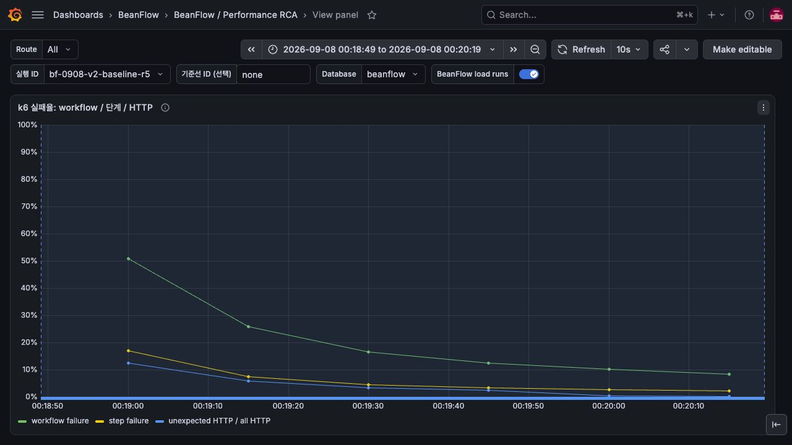
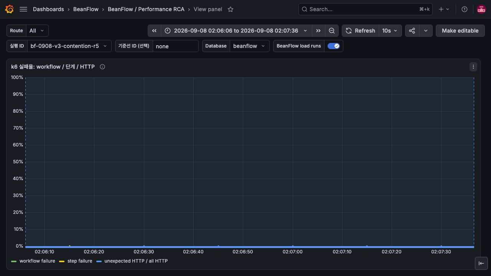

# 공유 자원 견적 안정성 수정과 부하 재측정 — 2026-09-08

공유 자원의 사용량 변화로 발생하던 견적 충돌을 수정하고 perf API에 배포했다. 같은 5 workflow/s
조건에서 450건 중 37건(8.22%)이던 충돌이 0건이 됐다. v3의 6회 실행은 총 3,120건 모두 결제
승인까지 성공했다. 다만 최초 5/s 실행의 미투입 1건과 20/s의 실제 잠금 대기는 별도 문제로 남는다.

## 변경과 검증 범위

[기존 실측](performance-load-rca-2026-09-07.md)의 실패는 다른 고객의 예약·확정·해제로 공유 자원
사용량이 바뀔 때 v2 견적이 무효화되는 동작이었다.
[ADR-123](../adr/ADR-123-order-quote-trade-terms-and-shared-availability.md)에 따라 v3 fingerprint에서
공유 자원의 사용량과 version만 제외했다. 가격·메뉴·옵션·혜택 귀속·픽업 시간/정원
비교와 최종 트랜잭션의 owner row lock 및 실제 잔여량 검사는 유지한다.

- 변경 전: 새 회귀를 포함한 19개 중 독립 owner 전이, 충분한 자원의 사전 견적 동시 주문 3개가 실패했다.
- 변경 후: 동일 19개와 관련 77개 class의 368개 테스트가 모두 통과했다. 마지막 자원의 동시 주문은 한 건만 성공하고, 나머지는 typed failure로 종료하며 같은 키로 재생된다.
- 전체 CI: [34135925797](https://github.com/kdh949/BeanFlow/actions/runs/34135925797), 앱 변경 commit `1941c6201e7110f01c0eae15318f52b3dc25c5f6`, Passed.
- 이미지: [34136862007](https://github.com/kdh949/BeanFlow/actions/runs/34136862007), revision `5aaec5281dbebf88b7465dbc294152fb3003019c`, packaged perf/portfolio startup·dependency failure smoke 및 API/web publish Passed. 후속 두 CI commit은 runner 도구와 fixture 접근 권한만 수정했다.
- API immutable manifest: `ghcr.io/kdh949/beanflow-api@sha256:0e9439089dd6042ac824b22910e8b5b6e680474df18d4728ee56ce29535f00d5`.
- Image config digest: `sha256:607b6fbe5dcd13c704ee38bcd44f63aedf524a73a4d3b2b5e840d290b6bb8b5b`. 앱 Docker의 image ID는 위 manifest digest로 표시된다.

## 배포 확인

2026-09-08 02:00 KST 배포를 시작해 API health/AIStor/cursor key 검증을 통과했다. 실행 중 image ID와
revision을 직접 재확인했다. API 외 모든 의존 container identity는 유지했고 PostgreSQL data volume은
`beanflow-staging_postgres-data`다. 기존 이미지/override backup은 앱 서버
`/var/backups/beanflow-quote-v3-20260907T170039Z`다. frontend는 기존 이미지를 유지한다.

서버에서도 두 고객의 견적을 미리 받은 뒤 순서대로 주문했을 때 모두 201로 생성됐다. 첫 주문 후
두 번째 고객의 fingerprint는 동일했고 두 요청의 terminal replay도 원래 order ID와 일치했다.
배포 전 미제출 v2 견적은 새 견적·명시적 재확인·새 멱등 키가 필요하다. 저장된 terminal replay는 유지한다.

## 측정 조건

발생기는 같은 Mac의 k6 2.2.0이며 공개 HTTPS/WAF 경로와 TLS 검증을 유지한다. 데이터는 합성 고객
20명, 매장·메뉴 각 1개, 미래 슬롯 4개다. 정상 시나리오는 견적→주문→결제 준비→
승인까지이며 Toss는 내부 계약 드라이버다. 자동 재견적·오류 재시도는 하지 않는다.
VU는 실행 worker 수이고, 40/80 VU 실행도 인증 계정은 같은 20개를 사용한다.

API 2 GiB, PostgreSQL 1.5 GiB, Hikari max 10, perf trace sampling 1.0과 wall profile 10ms를 유지한다.
앱은 Doppler, 모니터링은 기존 env 파일을 사용한다. DB는 승인된 기존 `beanflow`다.
`bf-0908-v2-baseline-r5`와 `bf-0908-v3-contention-r5`의 rate·duration·VU·script hash·논리 데이터셋·
발생기·k6 버전·메모리/JVM/계측 설정·의존 이미지 비교는 모두 일치했다. fixture hash도 동일하다.

누적 데이터와 접수 만료·환불 background worker, API 재시작 및 예열 차이는 남는다. 따라서 같은
설정의 오류율 비교를 동일 DB snapshot 실험이나 엄격한 지연 개선율로 해석하지 않는다.
기준선은 로컬 compile/test를 종료한 뒤 실행했고 v3 측정 중에도 로컬 build/test를 하지 않았다.
예열은 별도 30초 실행으로 기록했으며 JVM이 완전히 동일하게 예열됐다는 증거는 아니다.

## 실행 결과

workflow/s는 HTTP RPS와 다르다. v3 정상 흐름은 workflow당 HTTP 4회이며 총 12,480회 요청했다.
최종 건수는 native k6 summary 기준이다. PASSED는 HTTP p95 1초, 실패율 1%, 미투입 0 등의
실행기 기준을 통과했다는 뜻이며 승인된 서비스 SLO나 최대 처리 용량을 뜻하지 않는다.
전체 workflow p95에는 별도의 1초 threshold를 설정하지 않았다.

| 실행 | 시작률 · 투입 시간 | VU 사전 / 상한 | 완료 / 승인 | 실패 | 미투입 | HTTP p95 / p99 | workflow p95 | 판정 |
|---|---|---:|---:|---:|---:|---:|---:|---|
| [bf-0908-v2-baseline-r5](http://172.16.16.18:3000/d/beanflow-performance-rca/beanflow-performance-rca?from=1788794329121&to=1788794419490&var-test_id=bf-0908-v2-baseline-r5) | 5/s · 90s | 10 / 20 | 450 / 413 | 37 | 1 | 105.7 / 381.6ms | 290.7ms | FAILED |
| [bf-0908-v3-warmup](http://172.16.16.18:3000/d/beanflow-performance-rca/beanflow-performance-rca?from=1788800618916&to=1788800649168&var-test_id=bf-0908-v3-warmup) | 1/s · 30s | 4 / 10 | 30 / 30 | 0 | 0 | 147.0 / 487.9ms | 649.7ms | PASSED |
| [bf-0908-v3-normal-r1](http://172.16.16.18:3000/d/beanflow-performance-rca/beanflow-performance-rca?from=1788800667396&to=1788800757734&var-test_id=bf-0908-v3-normal-r1) | 1/s · 90s | 4 / 10 | 90 / 90 | 0 | 0 | 129.8 / 160.4ms | 392.4ms | PASSED |
| [bf-0908-v3-contention-r5](http://172.16.16.18:3000/d/beanflow-performance-rca/beanflow-performance-rca?from=1788800766130&to=1788800856618&var-test_id=bf-0908-v3-contention-r5) | 5/s · 90s | 10 / 20 | 450 / 450 | 0 | 1 | 236.7 / 613.9ms | 935.3ms | FAILED |
| [bf-0908-v3-r5-vu20](http://172.16.16.18:3000/d/beanflow-performance-rca/beanflow-performance-rca?from=1788800923437&to=1788801014165&var-test_id=bf-0908-v3-r5-vu20) | 5/s · 90s | 20 / 20 | 450 / 450 | 0 | 0 | 207.9 / 513.5ms | 608.4ms | PASSED |
| [bf-0908-v3-r10-vu40](http://172.16.16.18:3000/d/beanflow-performance-rca/beanflow-performance-rca?from=1788801075843&to=1788801166380&var-test_id=bf-0908-v3-r10-vu40) | 10/s · 90s | 40 / 40 | 900 / 900 | 0 | 0 | 130.7 / 439.4ms | 521.3ms | PASSED |
| [bf-0908-v3-r20-vu80](http://172.16.16.18:3000/d/beanflow-performance-rca/beanflow-performance-rca?from=1788801211485&to=1788801272113&var-test_id=bf-0908-v3-r20-vu80) | 20/s · 60s | 80 / 80 | 1200 / 1200 | 0 | 0 | 343.4 / 710.1ms | 1524.9ms | PASSED |

## 원인과 해석

### 1. 견적 무효화는 해결됐고 거래 정합성도 유지됐다

v2 기준선은 서버 quote conflict counter가 112→149로 37건 증가했고 DB에도 주문 409가 37건
남았다. v3의 3,120개 workflow는 모두 201 주문과 APPROVED 결제에 대응한다. 별도 재현과
회귀 테스트도 사용량 변화에 견적이 안정적임을 확인했다. 단순히 오류를 무시하거나 재시도해
성공률을 올린 결과가 아니다.

종료 후 repeatable-read read-only DB snapshot에서 실행별 멱등 레코드·distinct order·결제 승인
건수가 native summary와 일치했다. 공유 자원 counter와 활성 reservation 합계의 불일치는 0,
슬롯 초과 예약 0, 조회 당시 Lock waiting session 0이었다. 마지막 한 개 자원의 초과 예약 방지는
별도 PostgreSQL 동시성 테스트로 검증했다. 여유로운 자원을 쓴 부하 실행만으로 이를 증명하지 않는다.

### 2. 최초 5/s의 미투입은 VU 사전 확보 후 재실행에서 사라졌다

동일 조건의 v2/v3 실행 모두 미투입 1건, 실제 초기 VU 10개에서 할당된 최대 11개였다.
v3의 VU 20/20 재실행은 450건 완료·승인과 미투입 0으로 통과했다. 발생기의 사전 VU 확보가
필요하다는 실측 근거다. 뒤 실행은 예열·누적 데이터도 달라 VU만의 인과 효과나 지연 개선율까지
분리해서 입증한 것은 아니다. 원래 FAILED 결과와 threshold를 그대로 보존한다.
[k6 공식 설명](https://grafana.com/docs/k6/latest/using-k6/scenarios/concepts/arrival-rate-vu-allocation/)도
iteration 시간 변동에 맞춰 VU를 사전 확보하고 실행 중 동적 할당의 영향을 고려하도록 안내한다.

### 3. 실제 자원 예약의 잠금 대기가 다음 지연 개선 지점이다

v3 최초 5/s의 HTTP p95는 236.7ms, workflow p95는 935.3ms로 v2의 105.7ms/290.8ms보다 컸다.
같은 조건에서도 처리에 성공한 주문·결제가 413→450건으로 늘었고 예열·배경 작업이 달라졌다.
따라서 이번 변경을 응답 속도 개선으로 설명하지 않는다.

5/s trace `265ab3b109e678ae78ae51559f2e8362`의 주문 1,140.96ms 중 공유 행 잠금 조회가
583.21ms, 슬롯 잠금 조회가 390.49ms였다. 동일 root span의 profile `0e9652b12c7bc936`은
총 wall 1.14초 중 0.98초가 poll 대기로 기록돼 DB 응답 대기 해석과 일치했다.

20/s에서는 HTTP p95 343.4ms, workflow p95 1,524.9ms, Hikari active 최대 10/pending 최대 5,
관측된 미승인 lock 최대 3이었다. transactionid 대기와 tuple 대기도 각각 관측됐다.
trace `39135d683a75bbe5df1812dc020df9cd`의 confirmation 1,761.74ms 중 슬롯 잠금 조회가
1,402.49ms였고, trace `75f329ad56cca781d1f989a86a5daf78`의 주문 1,347.08ms 중 공유 행 잠금
조회가 1,254.04ms였다. 이 표본은 공유 행의 DB 응답 대기가 긴 요청을 설명한다. SQL span과
그를 감싼 repository span은 중복 구간이므로 더하지 않는다.

다음 개선은 잠금을 보유한 transaction의 query/flush 순서와 소요 시간을 확인하고, 동일 자원 경합
시나리오와 자원을 분산한 시나리오를 비교하는 것이다. 변경 시 현재 owner 잠금과 원자적 잔여량
검사, 멱등성은 보호해야 한다. PostgreSQL의 행 잠금은 transaction 종료까지 유지되므로 잠금 구간을
검토할 근거가 있다. [PostgreSQL 문서](https://www.postgresql.org/docs/current/explicit-locking.html)

### 4. 20/s 통과는 장시간 안정성이나 용량 상한의 증거가 아니다

20/s의 host CPU busy 표본 최대는 약 80.1%, API working set 최대는 약 0.98 GiB/2 GiB였다.
전체 workflow 지연과 DB 대기를 확인해 추가 증량을 종료했다. 다음 지속 부하는 우선 10/s에서
시간을 늘려 예열·만료·환불 worker·GC를 포함해 측정하고, 사용자 흐름의 p95/p99 예산도 정해야 한다.
앱 디스크는 종료 시 86% 사용, 여유 약 3.1 GiB이므로 장시간 측정 전에 보관량과 용량을 점검한다.
이 작업에서 DB volume이나 rollback 이미지는 삭제하지 않았다.

## Grafana와 증거 경계

- 브라우저에서 v3의 실행 ID와 정확한 시간 범위를 선택해 요청량, 연결 풀, DB lock/wait 그래프를 직접 확인했다. 5/s 초반 active 10/pending 2, 20/s active 10/pending 5 피크가 보였다.
- v3 6회 모두 k6 remote-write ingest와 Grafana annotation 게시를 확인했다. 기존 지연·자원·충돌·trace 패널로 이번 분석이 가능해 dashboard/schema는 추가 변경하지 않았다.
- 서버 지표는 해당 시간 전체 트래픽이다. k6 전송 완료를 위해 수집한 종료 후 15초 padding은 자원 통계에서 제외했다. 1/s의 padding에 다음 5/s가 포함된 표본을 1/s 포화로 잘못 집계하지 않았다.
- 10초/15초 scrape 표본은 더 짧은 잠금을 놓칠 수 있다. 예를 들어 10/s의 ungranted lock 표본 최대 0이어도 느린 trace에는 수백 ms의 잠금 조회가 있었다.
- 상단 rate 카드와 마지막 Prometheus 표본은 native summary의 최종 건수가 아니다. 실행 종료 후 No data를 성공·실패·0건으로 대체하지 않는다.
- Tempo 검색은 실행 ID와 200ms 이상 조건, 최대 100개 결과 중 느린 표본을 조회했다. 전체 느린 요청 개수나 전체 지연 분포로 사용하지 않는다.
- 5/s의 exact span profile은 조회됐지만 20/s 대표 두 span profile의 첫 조회는 빈 결과였다. 이 결과를 CPU 사용량 0 또는 원인 해소로 해석하지 않는다. 20/s 원인 근거는 trace·DB wait·pool 관측이다.

## 종료 상태와 후속 범위

부하 발생은 모두 종료했다. API/frontend/PostgreSQL/driver는 healthy이며 BeanFlow Prometheus 대상
5개는 UP이다. 부하 종료 후 active/pending과 DB Lock waiting session은 0으로 회복했다.

- Passed: 코드 회귀/동시성·관련 368개 테스트, 전체 CI, 이미지 smoke/build/publish, API 배포, 직접 재현·terminal replay, DB 정합성, 1/s·5/s VU20·10/s·20/s 실행 및 telemetry/Grafana 확인.
- Failed: 동일 조건의 첫 v3 5/s 실행은 미투입 1건 때문에 실행기 전체 기준 실패. 주문·결제 실패는 0건이며 재실행으로 원본 판정을 지우지 않는다.
- Not run: 장시간 soak/stress/capacity 상한, 실제 결제망, 여러 매장·메뉴를 분산한 workload, 잠금 구간 최적화 후 비교, v3 외부 결제 timeout/unknown 재주입.

원본 manifest/summary/Prometheus/trace/profile은 저장소 밖의 private 디렉터리에 보관한다.
credential/fixture와 원본 계정·세션은 증거 묶음 및 저장소에서 제외한다. 이 문서의 후속 commit은
실측 기록이며 배포 API revision `5aaec528`과 구분한다.

## PR용 Grafana 전후 캡처

동일 5/s·90s·pre/max VU 10/20 조건이다. 두 실행 모두 dropped 1로 전체 threshold는 FAILED다.
workflow 오류 37/450 → 0/450을 확인했으며 HTTP p95는 105.7 → 236.7ms로 증가했다.
견적 안정성 개선을 응답 속도 개선으로 해석하지 않는다. 현재 패널의 0~100% 고정 축으로 과거 데이터를
조회했다. 캡처의 rolling 값과 native 최종 통계는 다를 수 있다.

## 캡처 파일의 CI 등록

PR에 추가한 PNG가 기존 저장소 안전성 테스트의 명시적 바이너리 목록에 없어 CI가 실패했다.
검토한 이 PR 시리즈의 Grafana PNG 14개 경로만 공통 목록에 등록했다. 새 확장자 전체를 제외하거나
비밀 패턴 검사를 비활성화하지 않는다. `LocalDemoRepositorySafetyTest` 5개 테스트를 로컬에서
통과시켰으며, 변경된 각 PR head의 전체 CI를 다시 실행한다.
